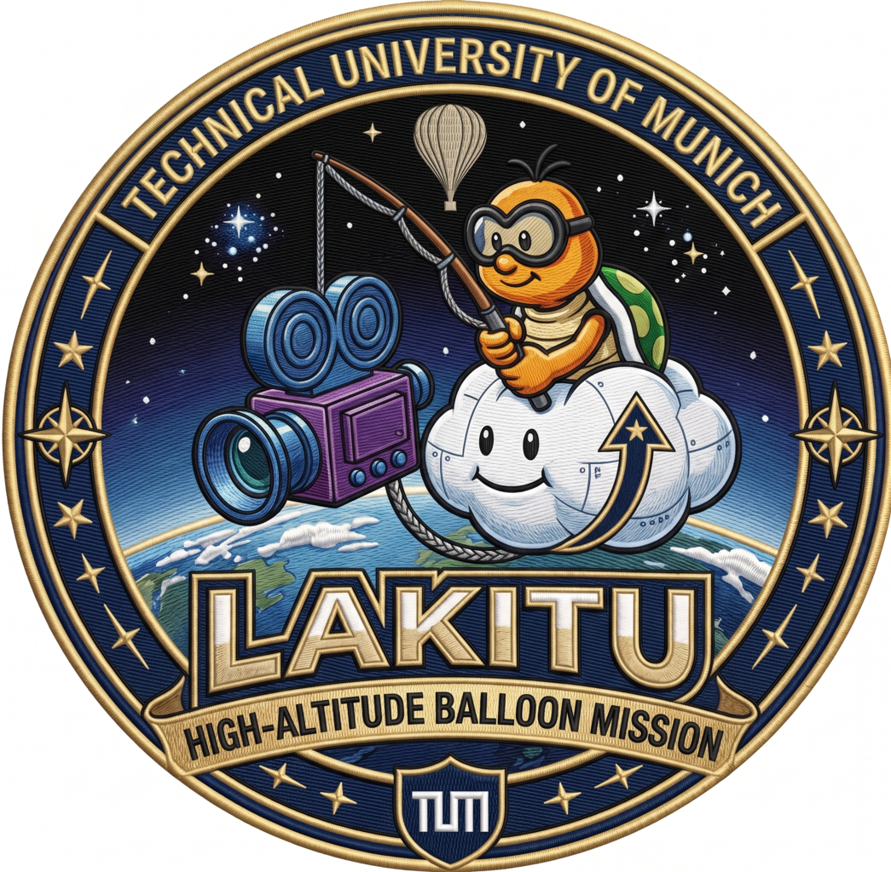

# Lakitu - 1U CubeSat Stratospheric Balloon Platform

Lakitu is a 1U CubeSat-format payload flown aboard a stratospheric balloon,
built as a TUM course project. The platform runs an autonomous 4 to 6 hour
flight managed by a six-phase finite state machine (Standby, Launch, Ascent,
Cruise, Descent, Landing). The on-board ML payload performs visual cloud-cover
estimation from a downward-facing camera, with every frame archived to SD and a
compact cloud-fraction record downlinked over LoRa.

## Repository layout

```
scsd-lakitu-cubesat/
├── payload/          ML payload (Coral Dev Board Micro) — see payload/README.md
│   ├── coral/        coralmicro app: cloud-cover estimator (+ coralmicro submodule)
│   ├── training/     Keras transfer-learning and int8 quantization pipeline
│   ├── data/         datasets — NOT tracked
│   └── models/       intermediate model artifacts — NOT tracked
├── firmware-stm32/   flight software and low-level drivers (one STM32L476RG binary)
├── interface_docs/   cross-target interface definitions (UART protocol, OBC handoff)
└── docs/             project-level docs (requirements, budgets, design notes)
```

## Build targets

Two independent binaries that do not share a toolchain:

1. STM32 firmware (`firmware-stm32/`): FSW, TT&C, and EPS/OBC drivers compiled
   into a single image for the STM32L476RG.
2. Coral payload (`payload/coral/`): the cloud-cover estimator, built out-of-tree
   against the coralmicro SDK for the Edge TPU (FreeRTOS).

The two communicate over UART (224x224 grayscale frame + 2-byte cloud fraction +
SEQ, 115200 baud). The protocol definition lives in `interface_docs/` so the
framing cannot drift between the OBC and Coral sides.

## Getting started

```bash
git clone git@github.com:k-hesselmann/scsd-lakitu-cubesat.git
cd scsd-lakitu-cubesat
git submodule update --init --recursive   # fetches coralmicro (large, one-time)
```

The coralmicro submodule is pinned to a branch carrying a board.h LPUART7 patch;
do not update it to upstream main without re-applying that patch.

## Data

Training datasets are not committed; only the deployment Edge TPU model is
tracked in git. See [payload/README.md](payload/README.md) for the dataset
sources, local layout, and the train → quantize → flash pipeline.
